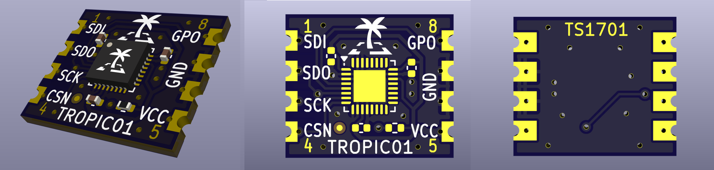

# TROPIC01 mini

This repository contains design files for the TROPIC01 minimal integration board TS17xx.
The ultimately small board for any purpose. Just control pins with power pins and that’s it. 

## Project structure

* `*.kicad_pro` - KiCad project file
* `*.kicad_sch` - Schematic file
* `*.kicad_pcb` - PCB layout file
* `./gerber/` - Generated gerber data for PCB manufacturing
* `./bom/` - Bill of materials including order codes, interactive BOM and assembly coordinates
* `./img/` - Images (PCB renders)
* `*_schematics.pdf` - Exported schematic diagrams (latest version)

# Manufacturing instructions

## PCB

 - Number of cu layers: 2
 - Board Thickness: 1.0
 - Core: FR4
 - Size: 14 x 12 mm
 - Mask: Blue
 - Silkscreen: Yes (TOP)
 - Castellated holes

## Assembly

There are no any special requirements for C and R components.
Where not specified the R tolerance is 5% and C 20%.

# About TROPIC01

For more information about the TROPIC01 secure element, please see the official documentation:

*   [TROPIC01 Datasheet](https://github.com/tropicsquare/tropic01/tree/main/doc/datasheet)
*   [TROPIC01 Website](https://www.tropicsquare.com/tropic01)

## Getting Started

To interact with the TROPIC01 chip on Linux-based systems like Raspberry Pi OS and Ubuntu, we provide the 
[`libtropic-linux`](https://github.com/tropicsquare/libtropic-linux) repository, containing integration examples 
of our platform-independent SDK, [`libtropic`](https://github.com/tropicsquare/libtropic).

 > [!IMPORTANT]
 > Before you start with various examples, we strongly recommend to do two things first:
 > * Read CHIP ID and TROPIC01's firmware versions and **save printed output for future reference**
 > * Update TROPIC01's both internal firmware to latest version.

In [`libtropic-linux`](https://github.com/tropicsquare/libtropic-linux) repository, you can find specific instruction for both operations based on hardware you use.

### Command line utility

Once you saved results of `show_chip_id_and_fw_ver` example (for future reference) and after your chip is updated with `fw_update` example, 
you can test our command line application. Check out [`libtropic-util`](https://github.com/tropicsquare/libtropic-util) repository, 
you can find there specific instruction based on hardware you use.

