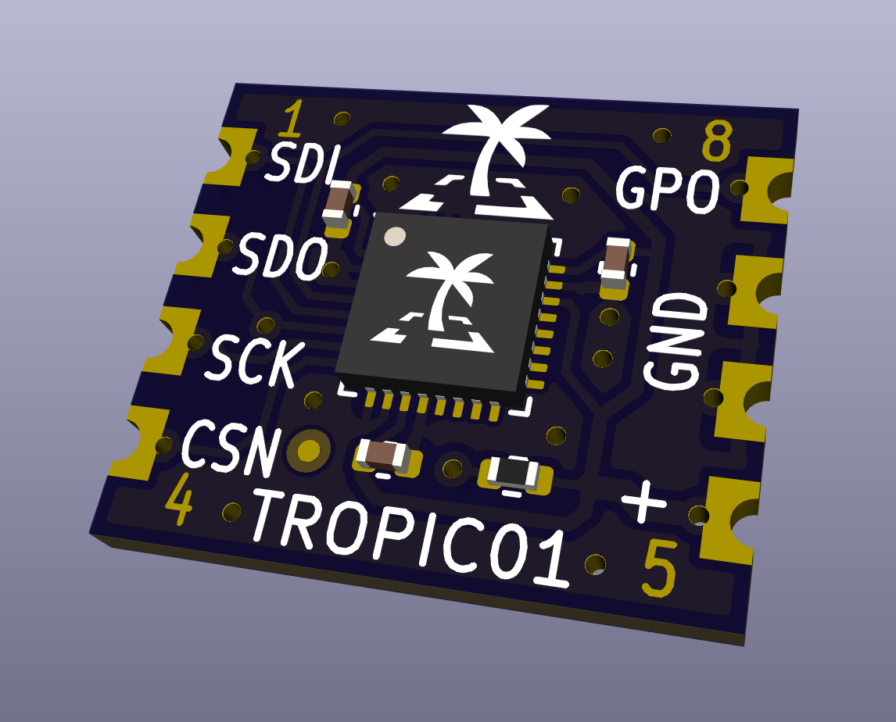

# About

PCB TS17xx.

Minimal integration sub-board for TROPIC01 chip.

# Manufacturing instructions

## Assembly

There are no any special requirements for C and R components.
Where not specified the R tolerance is 5% and C 20%.

## PCB

 - Number of cu layers: 2
 - Board Thickness: 1.0
 - Core: FR4
 - Size: 12 x 14 mm
 - Mask: Blue
 - Silkscreen: Yes (TOP)
 - Castellated holes

